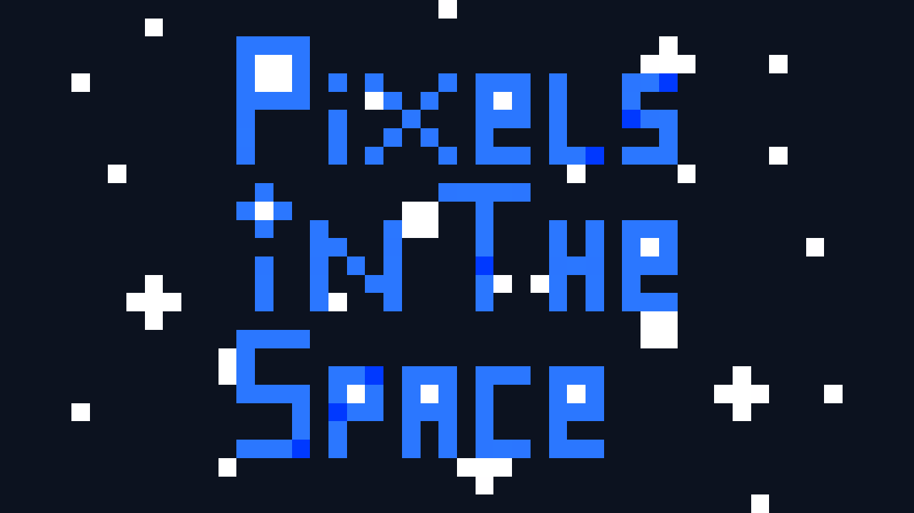

# Pixels In The Space 🚀

<!--

-->

## Description 📄

A simple Shoot em up, developed in C# with Unity.

## Table of Contents 📜

- [Installation](#installation)
- [Usage](#usage)
- [Contributing](#contributing)
- [License](#license)
- [Contact](#contact)
- [Contributors](#contributors)

<!--
- [Dependencies](#dependencies)
-->

## Installation 🔧

To build and run the game from the source code, follow these steps:

1. Clone the repository to your local machine using Git:

https://github.com/QuantumRevenant/PixelsInTheSpace.git

2. Open the project in Unity.
3. Build the game for your desired platform (e.g., Windows, macOS, Linux, etc.) using Unity's build settings.
4. Once the build is complete, you can find the executable in the specified output folder.

⚠️ *We don't have releases yet, only the legacy version in Itch.io (It is a compiled version without code).*

## Usage 🎮

To play the game, you can download the latest build from my [Itch.io page](https://quantumrevenant.itch.io/pixels-in-the-space).

Simply download the appropriate build for your platform and run the game executable.

Enjoy playing Pixels in the Space!

<!--
🚫 Bleeding-edge builds are generated automatically for every commit. You can see them [here](https://github.com/QuantumRevenant/PixelsInTheSpace/releases). 🚫
-->

⚠️ *We don't have releases yet, only the legacy version in Itch.io (It is a compiled version without code).*

## Contributing 🤝

See [CONTRIBUTING](CONTRIBUTING.md).

## License 📝

This project is licensed under the MIT License - see the [LICENSE](LICENSE) file for details.

## Contact ✉️

If you have any questions or feedback, feel free to reach out:

- 
- 

## Notice ⚠️

This codebase and documentation are primarily in Spanish or a mix of Spanish and English. If you plan to use this code in a different programming language (e.g., C++ or Java), please make the necessary changes accordingly.

## Contributors 👥

- [QuantumRevenant](https://github.com/QuantumRevenant)

## Resources used from Third Parties

This game uses the following MIT licensed code:

* [Deadcows/MyBox](https://github.com/Deadcows/MyBox)

Special thanks to the creators of these materials!

<!--
## Dependencies 🔗
-->

<!-- 
If you're reading this, you've probably seen that previous versions of this Readme had links to Mindustry. I originally relied on Anuken's Mindustry Readme. I had no idea how to make a Readme.md. I now have more knowledge of this and used a better Readme. Adapted to my needs.
Thank you for understanding my inexperience and I'm sorry for only taking the Anuken template
 -->
